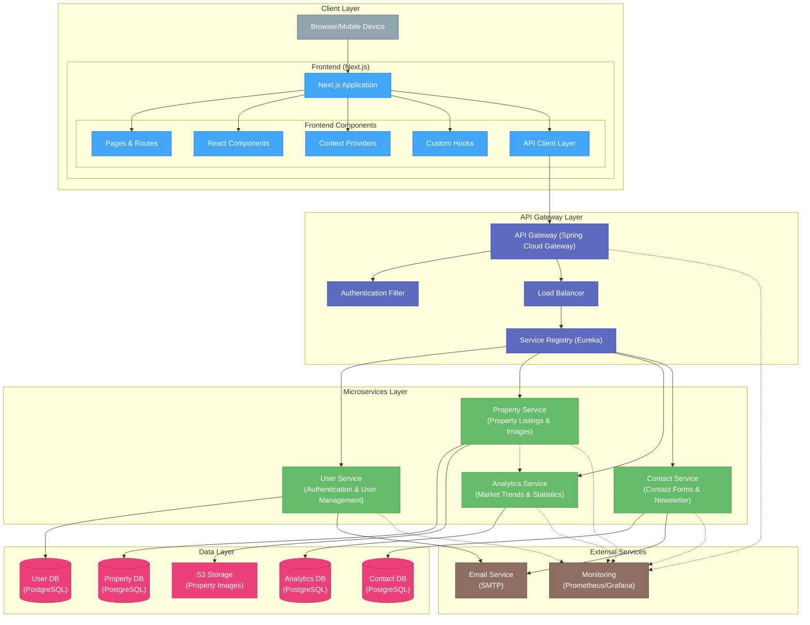
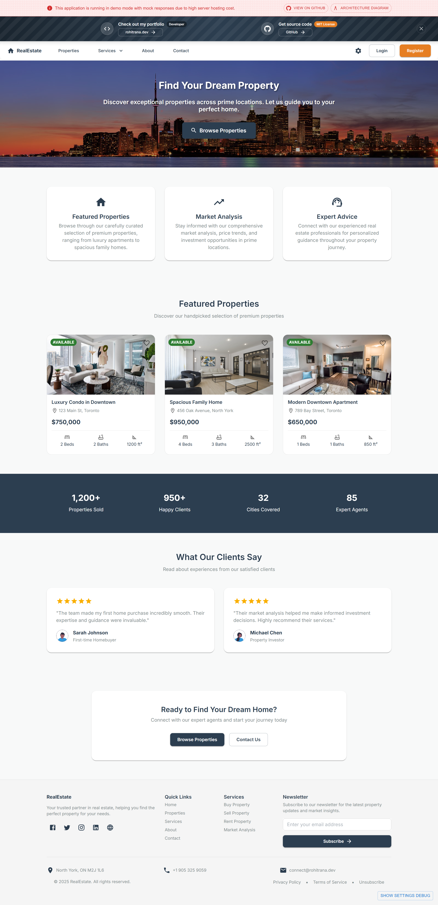
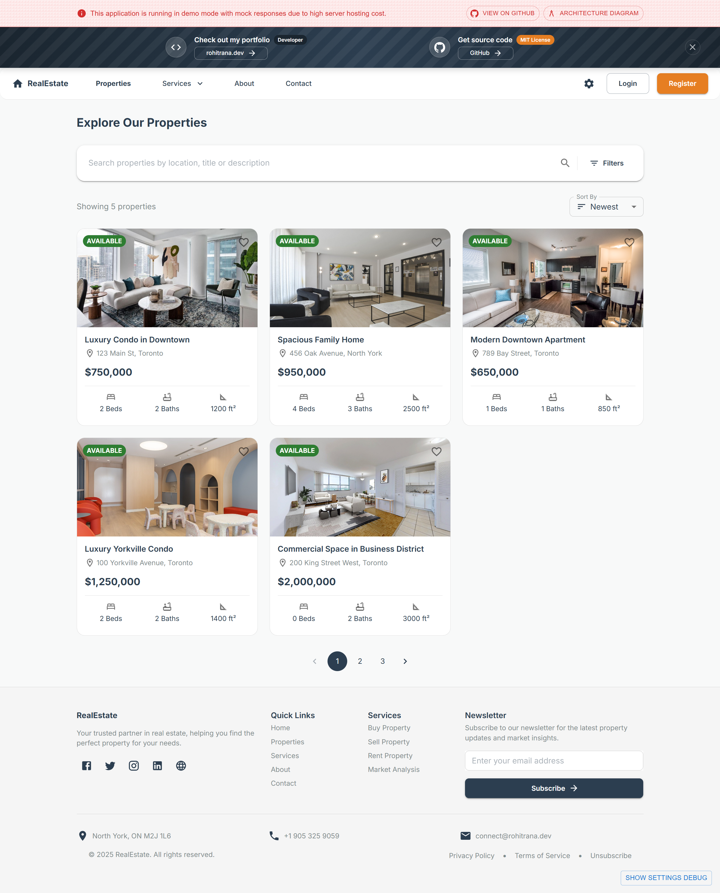
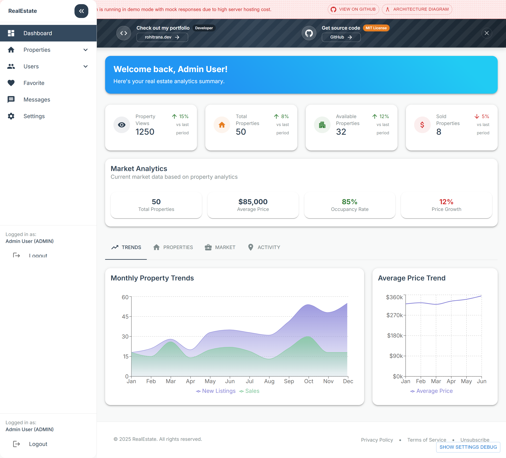

# Real Estate Management System

<div align="center">
  
  
  
  
  
  
  
  
</div>

<div align="center">
  <p>A comprehensive real estate platform for property management, browsing, and transactions</p>
  
  <h3>🌐 Live Demos</h3>
  <p>
    <a href="https://real-estatehub.rohitrana.dev/" target="_blank">real-estatehub.rohitrana.dev</a> | 
    <a href="https://real-estatehub.netlify.app/" target="_blank">real-estatehub.netlify.app</a>
  </p>
  
  <h3>⚠️ DEMO MODE NOTICE ⚠️</h3>
  <p>This application is currently running in demo mode with mock API responses due to hosting cost considerations.</p>
</div>

## 📋 Table of Contents

- [Overview](#-overview)
- [Features](#-features)
- [System Architecture](#-system-architecture)
- [Tech Stack](#-tech-stack)
- [Project Structure](#-project-structure)
- [Installation](#-installation)
- [Environment Setup](#-environment-setup)
- [Running the Application](#-running-the-application)
- [API Documentation](#-api-documentation)
- [Demo Access](#-demo-access)
- [Screenshots](#-screenshots)
- [Contributing](#-contributing)
- [License](#-license)
- [Contact](#-contact)

## 🏠 Overview

Real Estate Management System is a full-stack web application that helps users search for properties, manage listings, and facilitate real estate transactions. The platform serves three main user types: Clients looking for properties, Agents managing listings, and Administrators overseeing the platform.

The system is built with modern technologies including Next.js for the frontend, Spring Boot microservices for the backend, and PostgreSQL for data storage. The architecture follows microservices principles to ensure scalability, maintainability, and resilience.

## ✨ Features

### For Clients/Users

- 🔍 Search for properties with advanced filtering
- 💖 Save favorite properties
- 📝 Contact property agents
- 👤 User profile management
- 📧 Newsletter subscription

### For Agents

- 📊 Property listing management
- 📸 Property image upload and management
- 📩 Client inquiry management
- 📈 Basic analytics on property views

### For Administrators

- 👥 User management
- 🛠️ System configuration
- 🔒 Access control
- 📊 Advanced analytics

### General Features

- 🌐 Responsive design for all devices
- 🔐 Secure authentication with JWT
- 🌓 Light/Dark theme
- 🌎 Internationalization (English and French)
- 📄 Dynamic content management

## 🏛️ System Architecture

The Real Estate Management System follows a microservices architecture, with a Next.js frontend and Spring Boot backend services.



### Architecture Components

- **Frontend**: Next.js application with React, Material UI, and custom components
- **API Gateway**: Spring Cloud Gateway for routing and authentication
- **Service Registry**: Netflix Eureka for service discovery
- **Microservices**:
  - **User Service**: Authentication, user management
  - **Property Service**: Property listings, images, favorites
  - **Analytics Service**: Market trends and statistics
  - **Contact Service**: Contact forms and newsletter
- **Data Stores**:
  - PostgreSQL databases for each service
  - S3 for image storage
- **External Services**:
  - Email Service (SMTP)
  - Monitoring (Prometheus/Grafana)

## 🔧 Tech Stack

### Frontend

- **Framework**: Next.js 14
- **UI Library**: React 18
- **State Management**: React Context API
- **UI Components**: Material UI 5
- **Form Handling**: React Hook Form, Yup validation
- **HTTP Client**: Axios
- **Internationalization**: Custom solution with translation files
- **Maps**: Google Maps API
- **Charts**: Recharts

### Backend

- **Framework**: Spring Boot 3.2
- **API Gateway**: Spring Cloud Gateway
- **Service Discovery**: Netflix Eureka
- **Authentication**: JWT (JSON Web Tokens)
- **Database**: PostgreSQL
- **ORM**: Hibernate/JPA
- **Documentation**: OpenAPI/Swagger
- **Monitoring**: Prometheus/Grafana
- **Build Tool**: Maven

### DevOps & Infrastructure

- **Containerization**: Docker
- **Container Orchestration**: Kubernetes/ECS (planned for production)
- **CI/CD**: GitHub Actions (planned for production)
- **Cloud Provider**: AWS (planned for production)
- **Storage**: AWS S3 (for images)

## 📂 Project Structure

The project is organized in a monorepo structure with separate directories for frontend and backend services:

```
real-estate-management/
├─ frontend/             # Next.js frontend application
│  ├─ public/            # Static assets
│  ├─ src/
│  │  ├─ app/            # Next.js routes and pages
│  │  ├─ components/     # Reusable React components
│  │  ├─ contexts/       # Context providers
│  │  ├─ hooks/          # Custom React hooks
│  │  ├─ lib/            # API clients and utilities
│  │  ├─ theme/          # Theme configuration
│  │  ├─ types/          # TypeScript type definitions
│  │  ├─ translations/   # Internationalization files
│  │  └─ utils/          # Utility functions
│
├─ backend/              # Backend microservices
│  ├─ api-gateway/       # Spring Cloud Gateway
│  ├─ service-registry/  # Netflix Eureka service registry
│  ├─ user-service/      # User authentication/management
│  ├─ property-service/  # Property listing management
│  ├─ analytics-service/ # Analytics and reporting
│  └─ contact-service/   # Contact forms and newsletter
│
├─ infrastructure/       # Infrastructure configuration
│  ├─ docker/            # Docker configurations
│  ├─ kubernetes/        # Kubernetes manifests
│  ├─ terraform/         # Terraform scripts (planned)
│  └─ monitoring/        # Monitoring configurations
│
└─ docs/                 # Documentation
```

## 🚀 Installation

### Prerequisites

- Node.js (v18.x or higher)
- npm (v9.x or higher)
- Java 17
- Maven
- Docker and Docker Compose (for local development with all services)
- PostgreSQL (if running databases locally)

### Frontend Setup

```bash
# Clone the repository
git clone https://github.com/rohitrana043/real-estate-management.git
cd real-estate-management

# Install frontend dependencies
cd frontend
npm install
```

### Backend Setup

```bash
# Build the backend services
cd ../backend
mvn clean install

# Build individual services (example)
cd user-service
mvn clean install
```

## 🔑 Environment Setup

### Frontend Environment Variables

Create a `.env.local` file in the `frontend` directory:

```env
NEXT_PUBLIC_API_URL=http://localhost:8080
NEXT_PUBLIC_GOOGLE_MAPS_API_KEY=your_google_maps_api_key
```

### Backend Environment Variables

Each service has its own application.yml configuration. Example for user-service:

```yaml
server:
  port: 8082

spring:
  application:
    name: user-service
  datasource:
    url: jdbc:postgresql://localhost:5432/user_db
    username: postgres
    password: postgres
  jpa:
    hibernate:
      ddl-auto: update

eureka:
  client:
    serviceUrl:
      defaultZone: http://localhost:8761/eureka/
```

## 🚀 Running the Application

### Running in Demo Mode (Frontend Only)

```bash
# In the frontend directory
cd frontend
npm run dev
```

The application will be available at http://localhost:3000 with mock API responses.

### Running with Docker Compose (Full Stack)

```bash
# From the root directory
docker-compose up -d
```

This will start all services including:

- Frontend on port 3000
- API Gateway on port 8080
- Service Registry on port 8761
- User Service on port 8082
- Property Service on port 8083
- Analytics Service on port 8084
- Contact Service on port 8085
- PostgreSQL databases

### Running Individual Services (Backend)

```bash
# Service Registry
cd backend/service-registry
mvn spring-boot:run

# User Service
cd backend/user-service
mvn spring-boot:run

# Property Service
cd backend/property-service
mvn spring-boot:run

# Other services follow the same pattern
```

## 📚 API Documentation

API documentation is available through Swagger UI for each service when running locally:

- User Service: http://localhost:8082/swagger-ui.html
- Property Service: http://localhost:8083/swagger-ui.html
- Analytics Service: http://localhost:8084/swagger-ui.html
- Contact Service: http://localhost:8085/swagger-ui.html

## 🔑 Demo Access

For demo purposes, you can use the following credentials:

| Role          | Email                 | Password   |
| ------------- | --------------------- | ---------- |
| Administrator | admin@realestate.com  | Admin123!  |
| Agent         | agent@realestate.com  | Agent123!  |
| Client        | client@realestate.com | Client123! |

## 🖼️ Screenshots

<details open>
<summary>View Screenshots</summary>

### Home Page



### Property Browsing



### User Dashboard



</details>

## 🤝 Contributing

Contributions are welcome! Please feel free to submit a Pull Request.

1. Fork the repository
2. Create your feature branch (`git checkout -b feature/amazing-feature`)
3. Commit your changes (`git commit -m 'Add some amazing feature'`)
4. Push to the branch (`git push origin feature/amazing-feature`)
5. Open a Pull Request

Please ensure your code follows the existing style and includes appropriate tests.

## 📄 License

This project is licensed under the MIT License - see the [LICENSE](LICENSE) file for details.

## 📞 Contact

Rohit Rana - [@rohitrana043](https://github.com/rohitrana043) - [connect@rohitrana.dev](mailto:connect@rohitrana.dev)

Project Link: [https://github.com/rohitrana043/real-estate-management](https://github.com/rohitrana043/real-estate-management)

---

<div align="center">
  <p>⭐ Star this repository if you find it useful! ⭐</p>
  <p>Built with ❤️ by <a href="https://rohitrana.dev">Rohit Rana</a></p>
</div>
